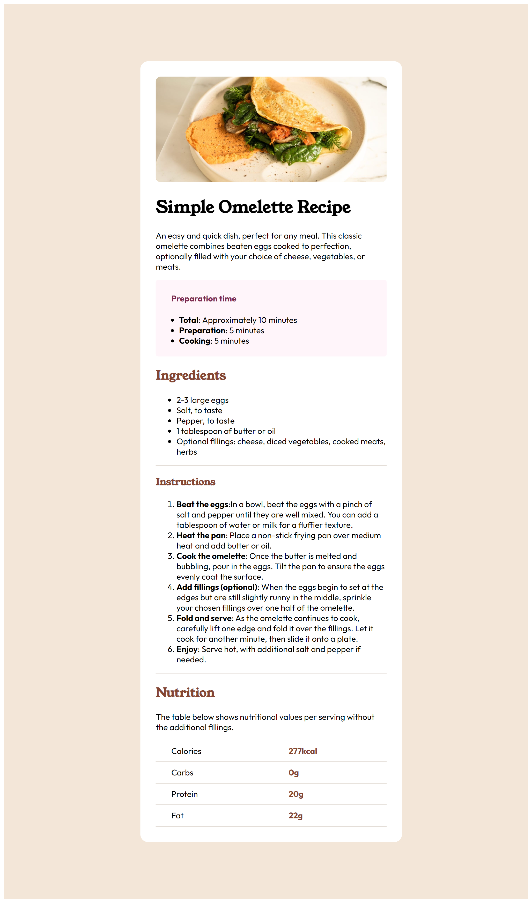
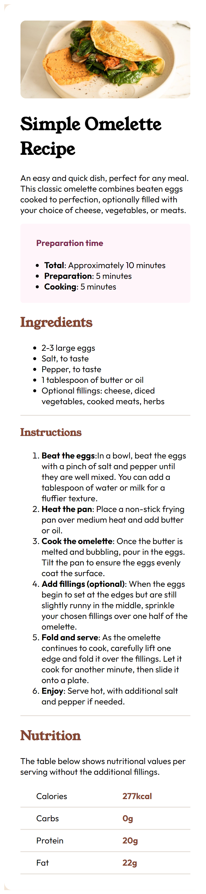

# Frontend Mentor - Recipe page solution

This is a solution to the [Recipe page challenge on Frontend Mentor](https://www.frontendmentor.io/challenges/recipe-page-KiTsR8QQKm). Frontend Mentor challenges help you improve your coding skills by building realistic projects. 

## Table of contents

- [Overview](#overview)
  - [Screenshot](#screenshot)
 
- [My process](#my-process)
  - [Built with](#built-with)
  - [What I learned](#what-i-learned)

## Overview
This is a responsive recipe page built using HTML and CSS. It features a visually attractive layout with an image, recipe title, preparation time, ingredients, instructions, and a nutrition table. The page adapts to different screen sizes using media queries.

### Screenshot
- Desktop design image

- mobile design image

## My process
1. Structure: I created the basic HTML structure for the page, including sections for the image, title, preparation time, ingredients, instructions, and nutrition table.
2. Styling: I applied CSS styles to customize the appearance of the page, including fonts, colors, layout, and responsiveness.
3. Responsiveness: I used media queries and grid to ensure the page adapts seamlessly to different device screen sizes.

### Built with

- Semantic HTML5 markup
- CSS custom properties
- Flexbox
- CSS Grid

### What I learned

- Building a well-structured HTML page.
- Applying CSS styles for visual design and responsiveness.
- Using media queries to create adaptive layouts.

